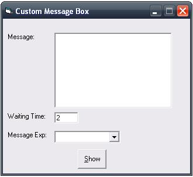



## MSN Messanger Message Box

### Description

This is a custom message box...just like the one in MSN Messangers...it will adjust its position according to the screen resolution...Its works jst like the normal MSGBOX function..in this message box there is no buttons yet..will add it in the next version...
 
### More Info
 

             |
---                |---
**Submitted On**   |2008-06-26 14:07:20
**By**             |[Sagar Gupta](https://github.com/Planet-Source-Code/PSCIndex/blob/master/ByAuthor/sagar-gupta.md)
**Level**          |Intermediate
**User Rating**    |5.0 (10 globes from 2 users)
**Compatibility**  |VB 6\.0
**Category**       |[Miscellaneous](https://github.com/Planet-Source-Code/PSCIndex/blob/master/ByCategory/miscellaneous__1-1.md)
**World**          |[Visual Basic](https://github.com/Planet-Source-Code/PSCIndex/blob/master/ByWorld/visual-basic.md)
**Archive File**   |[MSN\_Messan2118516262008\.zip](https://github.com/Planet-Source-Code/sagar-gupta-msn-messanger-message-box__1-70754/archive/master.zip)

